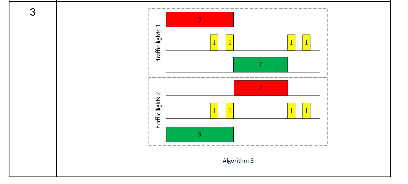

# LAB-2

Завдання:
    Реалізувати світлофор з вказаними параметрами і наведеними алгоритмами (премикання завдяки кнопці)

# PINOUT
Input:
Button ----> PB3(Pull-up )

Output:

Red led  ----> PA4      (10MHz)

Yellow led  ----> PA2   (10MHz)

Green led  ----> PA0    (10MHz)

# Пояснення функцій

--->

clearAllAlgo    ---> Очищує змінні і скидує всі значення по суті відключає алгоритми і повертає їх в початковий стан.

Switch_State    ---> Перемикає алгоритм на наступний (OFF -> ALGO_1 -> ALGO_2 -> OFF) і так по колу.

Led_Controle    ---> Відповідає за увмк. і вимк. ледів перевіряє скільки часу має горіти led.

SetLight        ---> Встановлює час роботи led.

Algo_1          ---> Алгоритм світлофора №1.

Algo_2          ---> Алгоритм світлофора №2.

Button_Cheker   ---> Відповідає за превірку кнопки.

